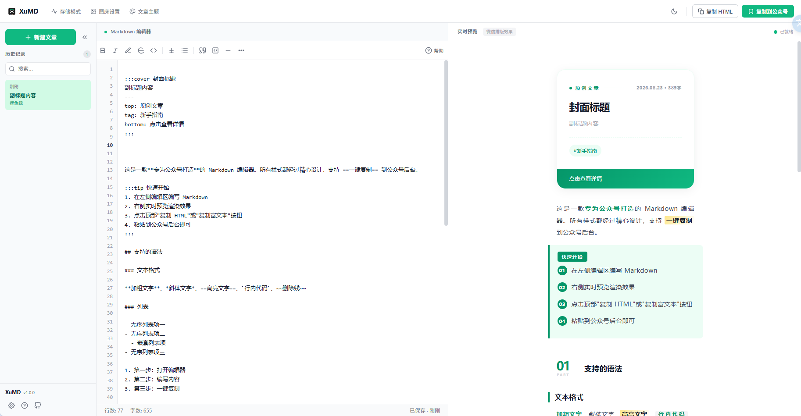
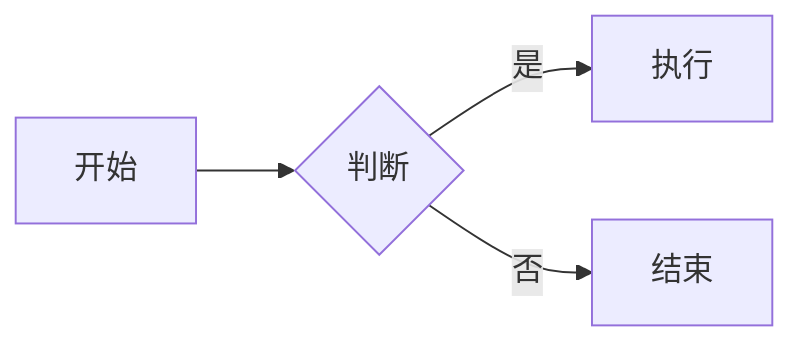

# XuMD

> 基于 WeMD 框架，移植 gzh-design-skill 核心组件与主题样式的公众号 Markdown 编辑器
> 
> 所有代码采用WorkBuddy开发，有问题可自行进行二次开发



## ✨ 特性

- **所见即所得** — 左侧编辑、右侧实时预览，滚动同步对齐
- **6 套精美主题** — 新墨绿·新绿、红白渐变、极简石墨、留白·空、车票、橄榄笔记
- **20+ 公众号组件** — 封面、章节标题、目录、提示卡片、引用、时间线、步骤列表、签名等
- **深浅模式** — 编辑器与预览区均支持浅色/深色模式切换
- **多种存储方式** — 本地存储（localStorage）+ 本地文件夹存储（File System Access API）
- **一键复制** — 复制 HTML / 复制到公众号，全部内联样式，粘贴即用
- **图床支持** — 本地 Base64 / 七牛云 / 阿里云 OSS
- **纯前端离线** — 无后端、无服务器，开箱即用
- **移动端适配** — 手机浏览器也能流畅编辑

## 🎨 主题预览

| 主题 ID | 名称 | 风格 |
|---------|------|------|
| `moyu-green` | 新墨绿·新绿 | 清新绿色、杂志风分割线 |
| `red-white` | 红白渐变 | 简约红、渐变封面 |
| `graphite-min` | 极简石墨 | 深色科技感 |
| `zen-empty` | 留白·空 | 极简留白、禅意 |
| `moyu-ticket` | 车票 | 车票虚线边框、复古风 |
| `olive-note` | 橄榄笔记 | 橄榄绿、菱形装饰 |

## 🚀 快速开始

### 环境要求

- Node.js >= 18.x
- npm >= 9.x

### 安装运行

```bash
# 克隆项目
git clone https://github.com/zhijiantv/XuMD.git
cd XuMD

# 安装依赖
npm install

# 开发模式
npm run dev

# 生产构建
npm run build

# 预览构建产物
npm run preview
```

构建产物在 `dist/` 目录。

## 📝 核心组件语法

### 封面

```markdown
::: cover
author: 作者名
date: 2024-01-01
top: 热门
tag: 技术
title: 文章标题
:::
```

### 章节标题

```markdown
/// 第一章 · 入门
```

### 目录

```markdown
[TOC]
```

### 提示卡片

```markdown
::: tip 温馨提示
这是一条提示内容
:::

::: warning 注意
这是一条警告内容
:::

::: info 信息
这是一条信息内容
:::

::: faq 常见问题
这是问答内容
:::
```

### 引用高亮

```markdown
::: quote
这是引用内容
:::
```

### 时间线

```markdown
::: timeline
- 2024年1月 · 项目启动
- 2024年3月 · 首个版本发布
:::
```

### 步骤列表

```markdown
::: step
- 第一步：准备材料
- 第二步：开始制作
- 第三步：享用成品
:::
```

### 签名

```markdown
[签名 作者名]
```

### 分割线

```markdown
---
```

### 行内标签

```markdown
<mytag>标签文字</mytag>
```

### 水平滑动图组

```markdown
<,,>
```

### 数学公式（KaTeX）

```markdown
行内公式：$E = mc^2$

公式块：
$$
\sum_{i=1}^{n} x_i = x_1 + x_2 + \dots + x_n
$$
```

### Mermaid 图表

````markdown

````

### GitHub 提示块

```markdown
> [!NOTE]
> 背景信息或补充说明

> [!TIP]
> 有用的小技巧

> [!IMPORTANT]
> 重要提示

> [!WARNING]
> 需要注意的问题

> [!CAUTION]
> 高风险操作警告
```

### 任务列表

```markdown
- [ ] 未完成任务
- [x] 已完成任务
```

### 文本样式扩展

```markdown
++下划线++   下划线
H~2~O         下标
X^2^          上标
:smile:       表情（GitHub 风格短代码）
## 标题 {.class #id}   局部属性 / 自定义样式
```

## 🏗️ 项目结构

```
XuMD/
├── public/              # 静态资源
│   ├── favicon.svg      # 浏览器标签页图标
│   ├── logo-dark.svg    # 深色模式 Logo
│   └── logo-light.svg   # 浅色模式 Logo
├── src/
│   ├── components/      # Vue 组件
│   │   ├── Sidebar.vue          # 左侧文章列表
│   │   ├── EditorPane.vue       # 编辑区
│   │   ├── PreviewPane.vue      # 预览区
│   │   ├── EditorHeader.vue     # 顶部工具栏
│   │   ├── ThemePanel.vue       # 主题面板
│   │   ├── StorageModal.vue     # 存储设置弹窗
│   │   ├── ImageHostModal.vue   # 图床设置弹窗
│   │   ├── SyntaxHelp.vue       # 语法帮助面板
│   │   ├── QuickToolbar.vue     # 快捷工具栏
│   │   ├── MobileToolbar.vue    # 移动端底部栏
│   │   └── Toast.vue            # Toast 提示
│   ├── composables/     # 组合式函数
│   │   ├── useDarkMode.ts       # 深色模式
│   │   ├── useEditorStorage.ts  # 文章存储
│   │   ├── useMobileView.ts     # 移动端检测
│   │   └── useThemes.ts         # 主题管理
│   ├── storage/         # 存储适配器
│   │   ├── types.ts             # 接口定义
│   │   ├── LocalStorageAdapter.ts  # localStorage
│   │   └── FileSystemAdapter.ts    # 本地文件夹
│   ├── utils/           # 工具函数
│   │   └── darkModePreview.ts   # 深色模式预览
│   ├── xumd-gzh-render/ # 公众号渲染引擎
│   │   ├── index.ts             # 渲染入口
│   │   ├── md-it-plugin.ts      # markdown-it 插件
│   │   └── themes/              # 主题模板
│   ├── App.vue           # 根组件
│   └── main.ts           # 入口文件
├── index.html           # HTML 模板
├── vite.config.ts       # Vite 配置
├── tsconfig.json        # TypeScript 配置
└── package.json         # 项目配置
```

## 🧩 架构设计

### 主题系统

每套主题拆分为两部分：

- **structure** — 锁定，组件 HTML 模板、圆角、阴影、间距、卡片布局；用户不可修改，保证主题风格不变
- **tokens** — 色彩变量集合，支持用户自定义覆盖颜色

### 渲染流程

```
Markdown 文本
    ↓
markdown-it 解析 + 自定义插件（组件语法）
    ↓
主题模板替换（structure + tokens）
    ↓
全部内联 style（无 var()、无外部 style 标签）
    ↓
输出公众号兼容 HTML
```

### 存储适配器

通过适配器模式支持多种存储方式，可扩展：

- `localStorage` — 浏览器本地存储（默认）
- `filesystem` — 本地文件夹存储（需 Chrome/Edge 支持 File System Access API）

## 📱 移动端

移动端采用 Tab 切换布局（编辑/预览），底部工具栏提供常用操作：

- 编辑 / 预览切换
- 复制到公众号
- 更多菜单：复制 HTML、主题管理、存储模式、图床设置

## 🔧 技术栈

- **框架** — Vue 3 + TypeScript（strict 严格模式）
- **构建** — Vite 5
- **Markdown** — markdown-it + highlight.js
- **样式** — 原生 CSS + CSS 变量
- **存储** — localStorage / File System Access API
- **无后端** — 纯前端离线 Web 应用

## 📄 License

MIT
